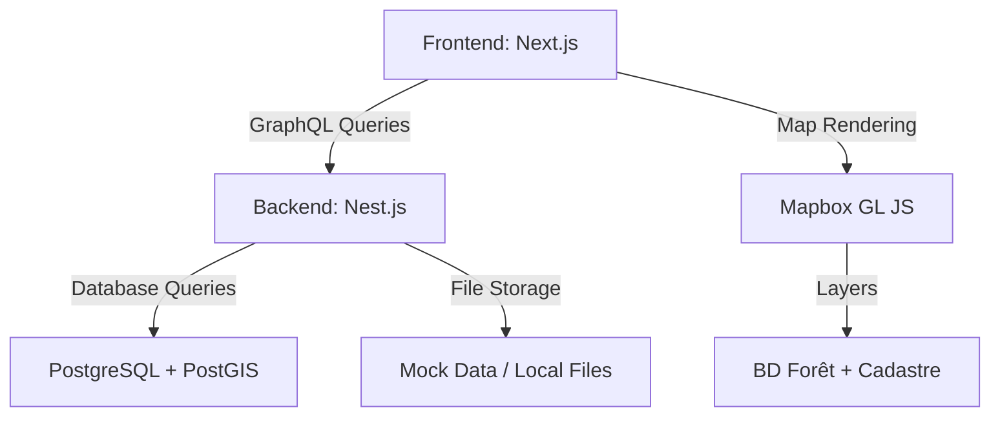
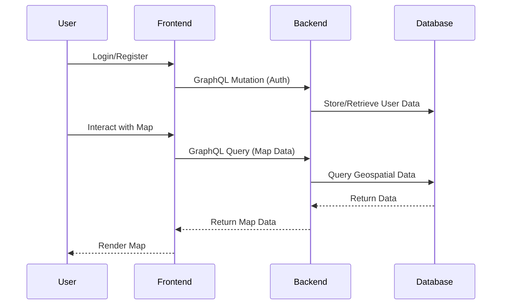

# Architecture Documentation

## System Architecture



### Components

1. **Frontend**:
   - Built with Next.js and TypeScript.
   - Integrates Mapbox GL JS for interactive mapping.
   - Handles user authentication and map interactions.

2. **Backend**:
   - Built with Nest.js and TypeORM.
   - Exposes GraphQL APIs for user management, geospatial data, and map state.
   - Stores user data and map state in PostgreSQL with PostGIS extensions.

3. **Database**:
   - PostgreSQL with PostGIS for geospatial data.
   - Stores BD Forêt and Cadastre data.

4. **Mapping Services**:
   - Mapbox GL JS for rendering maps and layers.
   - Mock data used for prototyping due to limited access to official geoservices.

## Data Flow



## Deployment Architecture

```
graph LR
    A[GitHub Actions] -->|CI/CD Pipeline| B[Docker Images]
    B -->|Docker Compose| C[Local Server]
    C -->|Frontend + Backend| D[User]
```

### Deployment Details
- **CI/CD**: GitHub Actions for building, testing, and deploying Docker images.
- **Docker Compose**: Orchestrates frontend, backend, and database services locally.

---

## File Path
This document is located at: `forest-bd-viewer/docs/architecture.md`